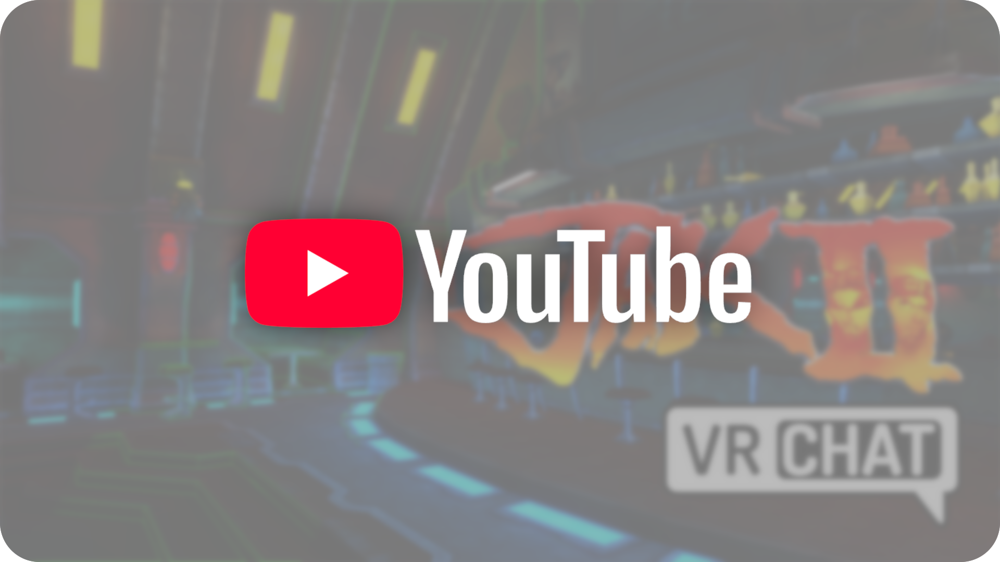
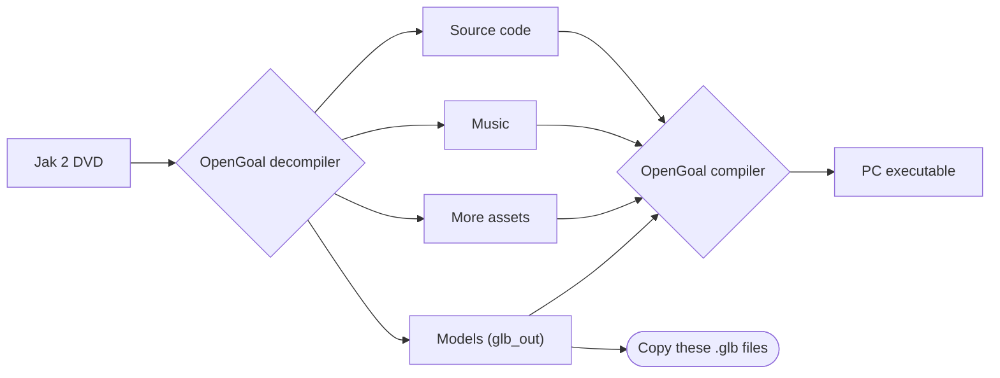
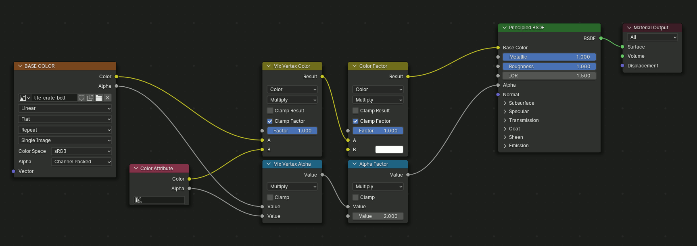
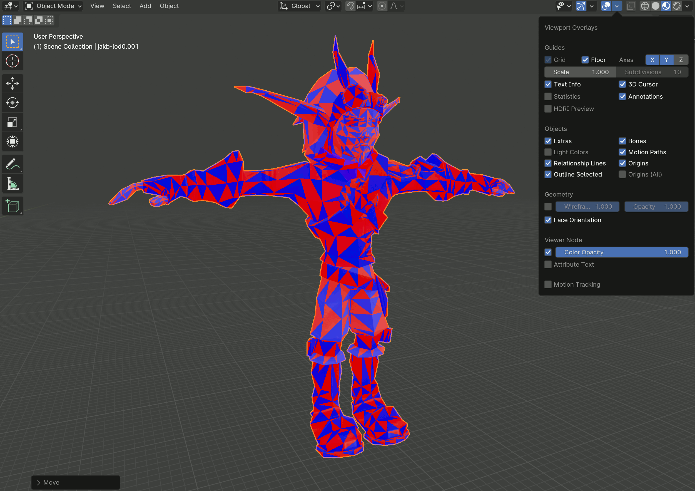
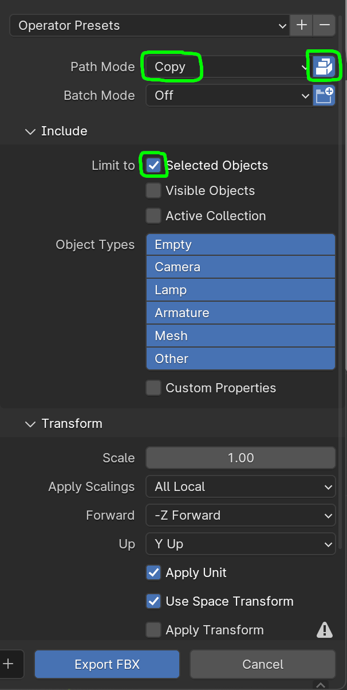
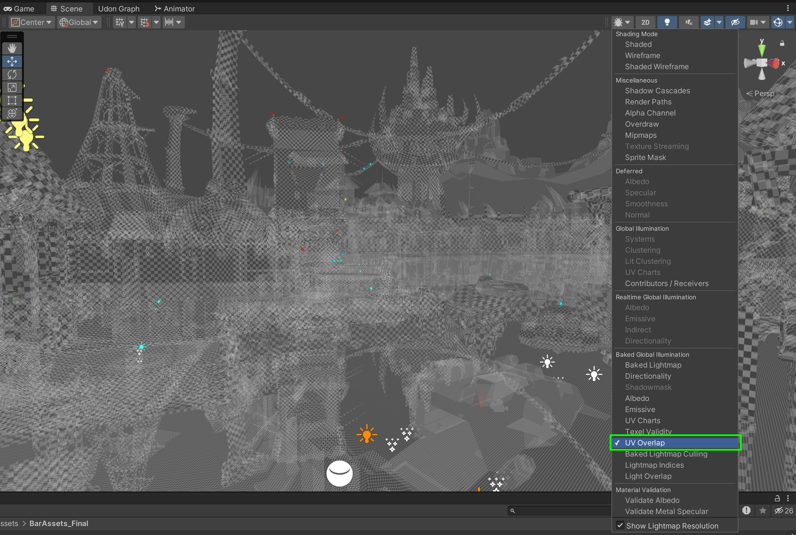
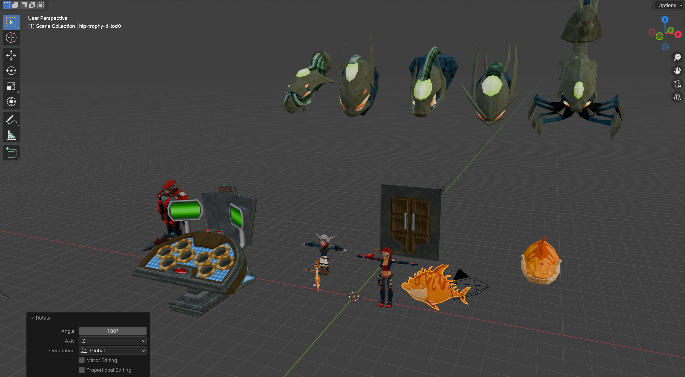
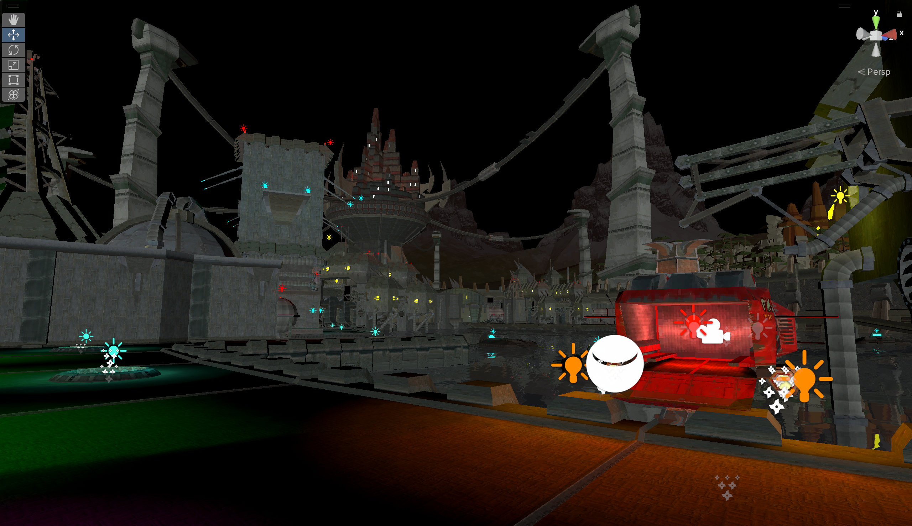
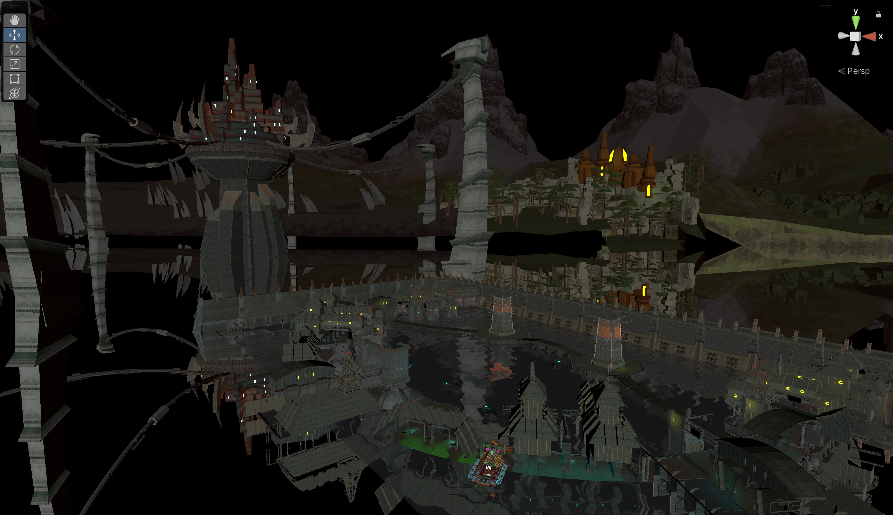
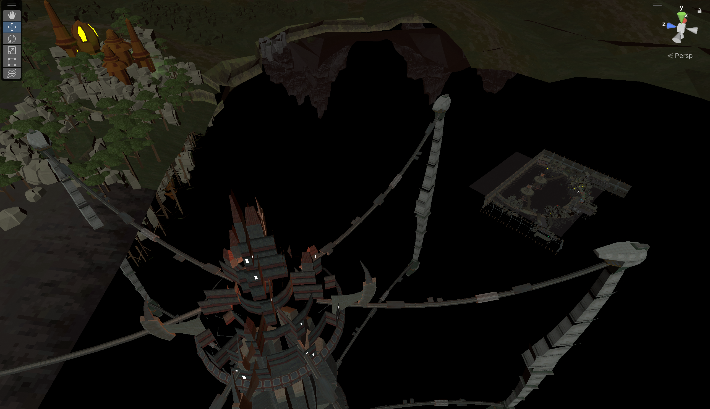

# WIP (work in progress)
// Traducir al inglés


En este manual voy a explicar como desarrollé el port del bar de Jak 2 desde los
archivos del juego hasta un mapa de VRChat, pasando por Blender y Unity.
Lamentablemente, este repositorio no contiene ningún archivo dado que varios de
los modelos 3D y texturas que uso están protegidos por derechos de autor.

# Video del resultado:
[](https://www.youtube.com/watch?v=aNAteD-LEzs)
// Poner más fotos del bar de jak, y poner junto con el video

# Características principales

- Todos los puntos de luz han sido colocados de forma manual y la luz
  que genera es toda baked (excepto la de la barra de pole dance)
- Reproductor de vídeo
- Barra de pole dance funcional
- Rotuladores para dibujar en 3D
- Las copas, vasos y sillas del bar son interactuables
- Barra de bar desactivable global
- Espejo de bar activable local
- Activación/desactivación del exterior e interior del bar
    - Cuando el jugador está en la ciudad, el interior del bar se desactiva
      completamente
    - Cuando el jugador entra en el bar, se desactiva la ciudad y se activa el
      interior
- El spawn de los jugadores está en un transporte de la guardia Carmesí que
  se mueve con una animación
- Neon del bar en 3D basado en el sprite original
- Partículas de polvo en suspensión en las zonas bien iluminadas
- Recolocadas el templo Precursor y el castillo de la ciudad para que sea
  visible desde el exterior del bar, aunque en el videojuego no están ahi
- La ciudad está a varios niveles de detalle, haciendo que la zona de juego
  mantenga la resolución de los modelos del juego original y todo lo demás
  con una resolución mucho más baja
- Agua que simula el reflejo de la ciudad. En realidad, toda la ciudad está
  duplicada en menor detalle abajo y al ser el agua semitransparente,
  aparenta que es un reflejo. El uso de técnicas como Reflection Probes o
  Screen Space Reflections no funcionaban bien
- Optimizadas las colisiones, que usan una versión de menor complejidad que
  el modelado de los objetos reales. Hay colisiones eliminadas para
  facilitar la jugabilidad, como las del ring o las de algunas lámparas
- La mesa/barra del bar tiene la altura ajustada para adaptarse a la altura
  real de los jugadores de VRChat

# Pasos

Este no es un manual completo, si no es un resumen de todos los pasos que he
realizado enfocándome en los pasos menos documentados en internet y que más
me costaron en el momento de hacerlo.

## Extraer modelos y texturas con OpenGoal

- Descargar [OpenGoal Launcher](https://opengoal.dev/): OpenGoal es un proyecto
  que consigue convertir varios juegos de Jak nativos de la Play Station 2 en
  juegos nativos de PC. OpenGoal descompila el código y extrae todos los assets
  del DVD original de Jak 2 y después lo vuelve a compilar para x86-64 (PC),
  permitiendo jugarlo de forma nativa. Nosotros vamos a extraer los assets en el
  paso intermedio: después de descompilar el juego original y antes de
  recompilarlo para PC



- Vamos a seguir los pasos que nos describe
  la [guía de OpenGoal](https://opengoal.dev/docs/usage/installation/) para
  jugar a Jak 2 en nuestro PC. OpenGoal solo ofrece las herramientas para
  convertir el juego de PlayStation 2, pero no el juego en si mismo, por lo
  que necesitaréis el juego original o un archivo ISO.
- OpenGoal no necesita exportar los niveles (mapas) del juego para generar el
  ejecutable final, y nosotros sí necesitamos esos archivos. Por ello, vamos a
  cambiar unos ajustes internos y vamos a volver a iniciar el proceso completo
  de descompilación-compilación.
    - En la ruta donde instalaste el juego, busca en la siguiente ruta:
      `Jak2\active\jak2\data\decompiler\config\jak2` y edita el fichero
      `jak2_config.jsonc`
    - Busca la variable `"rip_levels"` y ponla a `true`
    - Ahora volvemos a compilar el juego con OpenGoal: Avanzado -> Descompilar
    - En la ruta `Jak2\active\jak2\data\glb_out` aparecerán todos los modelos
      del juego en formato `.glb`.

## Preparado de los modelos con Blender

Uso Blender para preparar los modelos para Unity. En los archivos `.glb` vienen
todos los modelos texturizados de todo el juego, agrupados por temática. Al ser
archivos extraidos y preparados para ser usados por el motor gráfico de Jak 2,
hay ciertas cosas que hay que arreglar.

- Importar en blender el modelo en formato `.glb`
- Centrar los objetos importados usando la tecla `.` y escalarlos a un tamaño
  adecuado
- Ahora vamos a editar los shaders por defecto para que no haya problemas en
  Unity:
    - Hay que ir material por material editando los grafos de los shaders a mano
      en el `Shader Editor` (Shift + F3) quitando unos nodos intermedios que le
      ponen efectos no deseados:
      
    - En la parte de Materiales del modelo, hacer scroll hacia abajo buscando
      una caja desplegada llamada Settings y cambiar el `Blend Mode` de
      `Alpha Blend` a `Opaque`. Aunque para este caso, conseguí crear un script
      para iterar todos los materiales y editarlos de una sola vez. Para ello
      hay que abrir el layout Scripting y ejecutar el siguiente código en
      python:

```python
import bpy

# Recorre todos los materiales en el proyecto
for material in bpy.data.materials:
    try:
        material.blend_method = "OPAQUE"
    except Exception as e:
        print(f"Error al procesar el material {material.name}")
```

- Lo siguiente es arreglar hacia que dirección miran las caras de los
  polígonos (las normales), ya que por defecto vienen en alternancia, y nosotros
  queremos que todas las caras miren hacia afuera, dado que las caras que no
  miran a la cámara no se renderizan. Algunos atajos útiles para esto son:
    - Shift+G: Selección por tipo
    - L: Selección de todas las caras contiguas
    - Alt+N: Menú para recalcular normales manual o automáticamente
      

- Finalmente, vamos a exportar los modelos con sus texturas en formato `.
fbx`. Este paso es delicado y hay veces que puede no funcionar correctamente
  a la primera.
    - Asegúrate de tener el proyecto de blender guardado ya en un fichero
    - Debemos exportar las texturas fuera de nuestro archivo de blender. Para
      ello vamos a File -> External data -> Unpack resources. Ahora, al lado
      de nuestro fichero de blender habrá aparecido una carpeta llamada
      `textures`.
    - Debemos ir a File -> Export -> FBX y marcar las siguientes
      opciones a la derecha de la ventana emergente:
        - Path Mode: Copy
        - Marcar Embed textures (a la derecha del desplegable de Path Mode)
        - Marcar Selected Objects

          

## Creando el escenario para VRChat

Aquí viene la parte creativa, y no voy a centrarme mucho aquí, pero voy a
dar algunos tips en las partes del desarrollo donde me quedé más atascado.

- Primero, has de instalar VRChat Creator Companion. Este launcher a su vez
  instalará Unity, con el que crearemos nuestros mundos
- Una vez creado un mundo vacio de VRChat, vamos a importar los modelos
  `.fbx` que exportamos previamente en Blender.
- Pegamos el `.fbx` en los assets de nuestro proyecto de Unity
- Al seleccionarlo, se abrirá el inspector. Ahora vamos a personalizar distintos
  valores. Empezamos con el tab `Model`

  

    - Para que la iluminación se aplique correctamente al hacer `bake`,
      nuestros modelos necesitan `Lightmap UVs`, por lo que vamos a marcarlo.
    - Podemos modificar el `Hard Angle` para ajustar la suavidad o diferencia
      de iluminación entre varias caras.
    - Debemos ajustar el parámetro `Min Lightmap Resolution`: ponerlo bajo
      para los elementos que estarán lejos del jugador y alto para los
      cercanos, ya que más resolución significará que la iluminación será más
      realista (entre otros ajustes).
    - Aplicamos cambios
    - Podemos ajustar la resolución de todos los `Lightmap UVs` activando el
      siguiente modo de visualización:

      
- Ahora vamos con el tab `Materials`
    - Extraemos las texturas y los materiales
- A partir de aquí ya es ir montando el escenario usando todos los modelos y
  texturas, agregando iluminación, assets y lógica de programación con `Udon`

## Imágenes Blender





## Imágenes Unity








