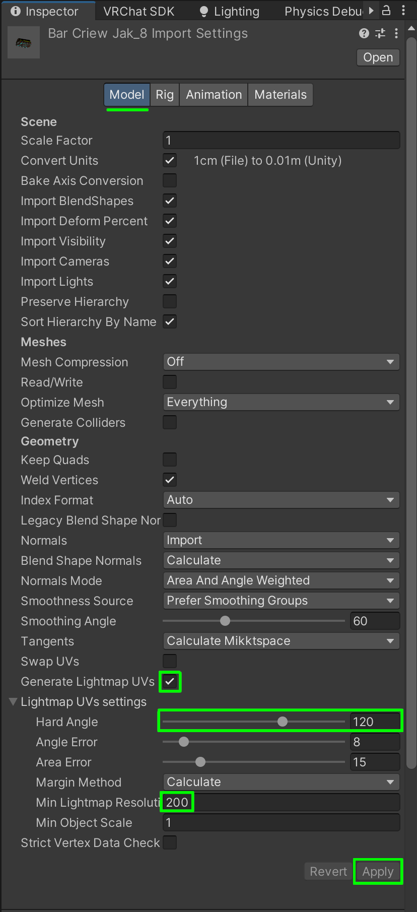
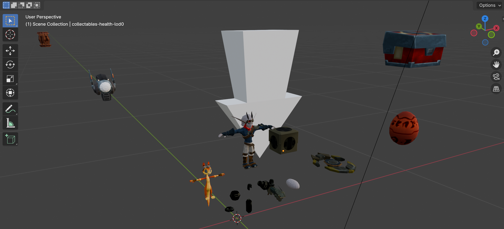

# Language

| **English** | [Español](README_ES.md) |
|-------------|-------------------------|

# Table of contents

<!-- TOC -->
* [Language](#language)
* [Table of contents](#table-of-contents)
* [Video of the Result](#video-of-the-result)
* [Main Features](#main-features)
* [Steps](#steps)
  * [Extracting Models and Textures with OpenGoal](#extracting-models-and-textures-with-opengoal)
  * [Preparing the Models with Blender](#preparing-the-models-with-blender)
  * [Creating the Environment for VRChat](#creating-the-environment-for-vrchat)
* [Blender Images](#blender-images)
* [Unity Images](#unity-images)
<!-- TOC -->


In this manual, I will explain how I developed the port of the Jak 2 bar from
the game's files to a VRChat map, going through Blender and Unity.
Unfortunately, this repository does not contain any files as several of the 3D
models and textures I used are copyrighted.

# Video of the Result

[](https://www.youtube.com/watch?v=aNAteD-LEzs)

# Main Features

- All light sources were placed manually, and the lighting is entirely baked (
  except for the pole dance bar).
- Video player.
- Functional pole dance bar.
- Markers to draw in 3D.
- Interactive bar cups, glasses, and chairs.
- Globally deactivatable bar.
- Locally activatable bar mirror.
- Activation/deactivation of the bar's exterior and interior:
    - When the player is in the city, the bar's interior is completely
      deactivated (is not renderer).
    - When the player enters the bar, the city is deactivated, and the interior
      is activated.
- The players' spawn is inside a moving Crimson Guard transport.
- 3D neon bar sign based on the original sprite.
- Suspended dust particles in well-lit areas.
- The Precursor temple and the city castle were repositioned to be visible from
  outside the bar, even though they are not there in the game.
- The city has multiple levels of detail, maintaining the original model's
  resolution in the playable area while lowering resolution for everything else.
- Water simulating the city's reflection. The city is duplicated below with
  lower detail, and since the water is semi-transparent, it appears as a
  reflection. Techniques like Reflection Probes or Screen Space Reflections did
  not work well.
- Optimized collisions using a lower complexity version of objects. Some
  collisions were removed to improve gameplay, such as the ring's and some
  lamps.
- The bar height was adjusted to match the real height of VRChat
  players.

# Steps

This is not a complete manual but rather a summary of all the steps I took,
focusing on the less documented and more challenging parts I encountered.

## Extracting Models and Textures with OpenGoal

- Download [OpenGoal Launcher](https://opengoal.dev/): OpenGoal is a project
  that converts several Jak games from PlayStation 2 into native PC games.
  OpenGoal decompiles the code and extracts all assets from the original Jak 2
  DVD before recompiling it for x86-64 (PC), allowing native play. We will
  extract the assets in the intermediate step: after decompiling the original
  game and before recompiling it for PC.


- Follow the steps in
  the [OpenGoal guide](https://opengoal.dev/docs/usage/installation/) to play
  Jak 2 on PC. OpenGoal only provides tools to convert the PlayStation 2
  game to PC, not the game itself, so you will need the original game or an
  ISO file.
- OpenGoal does not need to export game levels (maps) to generate the final
  executable, but we need those files. We will modify internal settings and
  restart the full decompilation-compilation process.
    - Find the installed game's path and locate:
      `Jak2\active\jak2\data\decompiler\config\jak2`.
    - Edit the `jak2_config.jsonc` file.
    - Locate the variable "rip_levels" and set it to `true`.
    - Recompile the game with OpenGoal: Advanced -> Decompile.
    - In the path `Jak2\active\jak2\data\glb_out`, all game models will appear
      in `.glb` format.

## Preparing the Models with Blender

Blender is used to prepare the models for Unity. The `.glb` files contain all
the game's textured models grouped thematically. Since they are extracted files
optimized for Jak 2's graphics engine, some adjustments are needed.

- Import the `.glb` model into Blender.
- Center and scale the objects appropriately.
- Modify default shaders to avoid issues in Unity:
    - Manually edit shader graphs in the `Shader Editor` (Shift + F3) to remove
      intermediate nodes that add unwanted effects.
      
    - Change one by one the `Blend Mode` from `Alpha Blend` to `Opaque` in the
      Materials settings. You can do this programmatically with the
      following Python script in Blender (opening Scripting layout):

```python
import bpy

# Iterate through all materials in the project
for material in bpy.data.materials:
    try:
        material.blend_method = "OPAQUE"
    except Exception as e:
        print(f"Error processing material {material.name}")
```

- The next step is to fix the direction in which the polygon faces (normals) are
  oriented since, by default, they alternate (outward, inward, outward,
  inward...). We want all faces to face outward because faces that do not
  face the camera are not rendered. Some useful shortcuts for this are:

    - Shift+G: Select by type
    - L: Select all contiguous faces
    - Alt+N: Menu to manually or automatically recalculate normals
      

- Finally, we are going to export the models with their textures in `.fbx`
  format. This step is delicate, and sometimes it may not work correctly on the
  first try.
    - Make sure you have the Blender project already saved as a file.
    - We need to export the textures outside our Blender file. To do this, go
      to File -> External Data -> Unpack Resources. Now, next to our Blender
      file, a folder named `textures` will appear.
    - Go to File -> Export -> FBX and enable the following options on the
      right side of the popup window:
        - Path Mode: Copy
        - Enable Embed Textures (to the right of the Path Mode dropdown)
        - Enable Selected Objects

          

## Creating the Environment for VRChat

This is the creative part, and I won’t focus too much on it, but I will give
some tips on the development steps where I got stuck the most.

- First, you need to install `VRChat Creator Companion`. This launcher will
  also install `Unity`, which we will use to create our worlds.
- Once a blank VRChat world is created, we will import the `.fbx` models that we
  previously exported from `Blender`.
- Paste the `.fbx` file into the `Assets` folder of your Unity project.
- When selecting it, the inspector will open. Now we will customize
  different settings, starting with the `Model` tab.

  

    - For lighting to be applied correctly when performing a `bake`, our models
      need `Lightmap UVs`, so we will enable this option.
    - We can modify the `Hard Angle` to adjust the smoothness or difference in
      lighting between the faces.
    - The `Min Lightmap Resolution` parameter should be adjusted—set it low
      for objects far from the player and high for closer ones, as higher
      resolution will make the lighting more realistic (among other effects).
    - Apply the changes.
    - We can adjust the resolution of all `Lightmap UVs` by enabling the
      following visualization mode:

      
- Now, let's move on to the `Materials` tab.
    - Extract the textures and materials.
- From here, it's just a matter of assembling the environment using all the
  models and textures, adding lighting, assets, and programming logic with
  `Udon`

# Blender Images




# Unity Images


